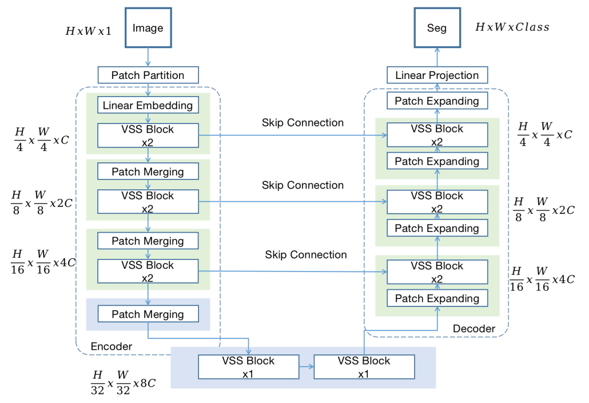
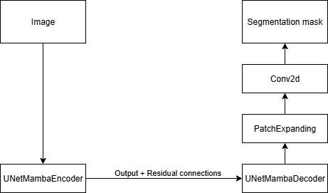

## UNet-Mamba Segmentation model

The project contains an implementation of UNet-like visual mamba model based on the architecture described in the paper https://arxiv.org/pdf/2402.05079v2 

## Architecture

The original architecture of UNet-Mamba model is shown in the following picture:




The entire UNet-Mamba architecture implementation is encapsulated inside the [LitMambaUnet](./src/mamba_unet_model.py) class.
When replaced with code components from the project, the same architecture can be represented as in the following image:



## Folder structure

* [src](./src) - source code folder
  * [config.py](./src/config.py) - various configuration settings shared in the project.
  * [dataset.py](./src/dataset.py) - creates segmentation DataSet and DataLoader objects and configures data transformation pipeline.
  * [lightning_train.py](./src/lightning_train.py) - the main script for running the ML model training process.
  * [mamba_unet_model.py](./src/mamba_unet_model.py) - contains an implementation of the UNet-Mamba architecture.
  * [predict.py](./src/predict.py) - runs model predictions on the test dataset.
  * [output](./src/ouput) - the folder is created after the ML training process is completed, the image containing the plot of the training and the validation loss is stored in it.
  * [checkpoints](.src/checkpoints) - the folder is created during the ML training process, it contains the Lightning checkpoints.
* [requirements.txt](./requirements.txt) - the project requirements regarding the required Python packages.

## The dataset prerequisities

By default, it's assumed that the dataset folder is placed inside the project root folder (defined by the **DATASET_PATH** variable in the 
[config.py](./src/config.py) file).
It's also assumed that the dataset folder has two folders, **images** and **masks**.
Images in the dataset are automatically converted to size defined by the **INPUT_IMAGE_SIZE** variable in the [config.py](./src/config.py) file.
This is done by the data transformation pipeline when the images are loaded.

## The ML model training

The ML model training can be started by running:

```bash
python src/lightning_train.py
```

## The ML model prediction

To run the ML model prediction execute:

```bash
python src/predict.py
```


